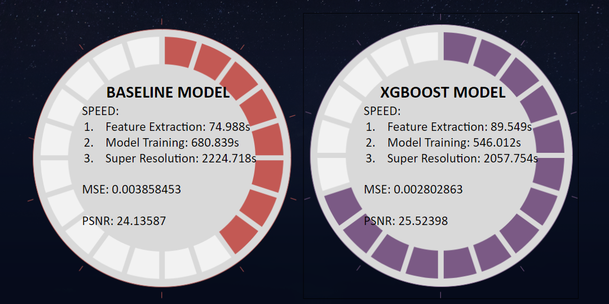

# Project: Can you unscramble a blurry image? 


### [Full Project Description](doc/project3_desc.md)

Term: Fall 2018

+ Team #3
+ Team members
	+ Yingqiao Zhang
	+ Ghada Jerfel
	+ Xiaoyi Li
	+ Peilin Li
	+ Shiqing Long

+ Project summary: 
	+ In this project, we worked on assessing predictive models that improves on the gradient boosted stumps baseline model, hence allowing us to turn a low resolution image into a high resolution image. Ultimately, the process of model selection led to finding that the best model was XgBoost.
	+ First, we do model training using features of several samples extracted from low-resolution images and high-resolution images. For each sample, we extract features from the nearest 8 neighbor pixels in the low-resolution images and extract features from 4 corresponding pixels in high-resolution images, then we save them in 2 feature matrices, respectively. Then we train our models using these features and save parameters of the model with best performance.
	
	+ Then we try to build models including GBM, SVM, XgBoost, Random Forest, Neural Network, Linear Regression. In model assessment part, XgBoost outperforms other models so we choose it as our proposed model:
	
	+ Comparing with the baseline model, XgBoost model improves with respect to both running time and image quality:
	
	
	
	
**Contribution statement**: ([default](doc/a_note_on_contributions.md))
+ Project leader:
	+ Yingqiao Zhang：Designed and organized the structure of whole project. Built and optimized the baseline model. Tuning parameters for the xgboost model. 
+ Major contributor:
	+ Xiaoyi Li: Build xgboost model and random forest model. Tuning parameters for the xgboost model and random forest model.
	+ Shiqing Long: Search methods to improve the baseline models. Applied svm as advanced model to improve the performance, do cv and calculate PSNR and MSE. Also prepared presentation slide.
+ Equal contribution：
	+ Ghada Jerfel: built the linear regression model, edited the readme file, as well as made the presentation slides.
	+ Peilin Li: Code feature.R and superResolution.R files, edit Github and make the presentation slides.

Following [suggestions](http://nicercode.github.io/blog/2013-04-05-projects/) by [RICH FITZJOHN](http://nicercode.github.io/about/#Team) (@richfitz). This folder is orgarnized as follows.

```
proj/
├── lib/
├── data/
├── doc/
├── figs/
└── output/
```
+ Both baseline and xgboost models can be implemented separately by choosing the folder you want to use.
+ Please see each subfolder for a README file.
